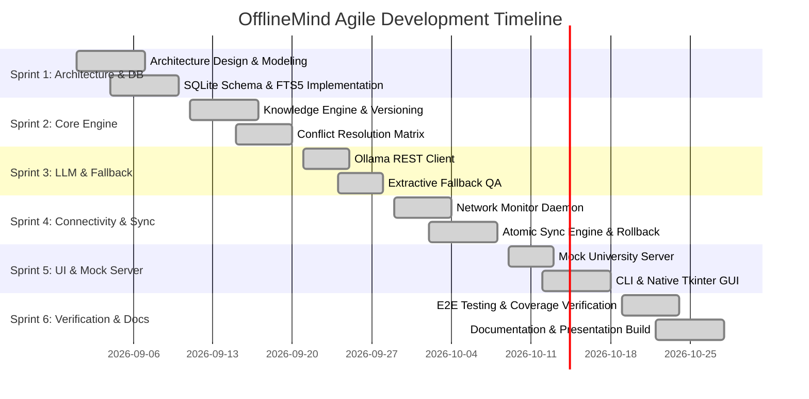

# OfflineMind: Project Management Plan

**Project Name**: OfflineMind – An Offline-First, Self-Updating AI Assistant  
**Author / Lead Architect**: OfflineMind Engineering Core Team  
**Date**: October 2026  
**Document Version**: 1.0.0  
**Status**: Completed & Verified  

---

## 1. Executive Summary & Problem Statement

Modern conversational AI assistants (such as ChatGPT, Claude, and Gemini) operate predominantly in centralized cloud infrastructures. This paradigm incurs major drawbacks:
1. **Network Dependency**: Users lose all access to information retrieval and automated reasoning in air-gapped, remote, field, or transit environments.
2. **Data Privacy Risks**: Personal queries and proprietary domain knowledge are transmitted across third-party networks and stored in remote cloud servers.
3. **Knowledge Staleness vs. Update Latency**: When network connectivity is intermittent, devices either remain permanently out of date or risk database corruption during partial, disrupted updates.

**OfflineMind** resolves this dilemma by delivering an **offline-first, self-updating architecture**. OfflineMind executes local inference and retrieval on standard consumer hardware (laptops with 8 GB RAM) without external network dependencies. When internet connectivity is restored, OfflineMind safely and automatically updates its stored knowledge base from trusted endpoints, archives historical facts immutably, and returns to offline operation with zero data corruption.

---

## 2. Project Objectives

- **O1 (Zero-Latency Offline Retrieval)**: Answer factual queries locally in under 100 milliseconds using SQLite FTS5 BM25 search without making external HTTP calls.
- **O2 (Local LLM Generation with Graceful Fallback)**: Support grounded natural language answers via local Ollama models (Phi-3 Mini / Llama 3.2 3B), falling back seamlessly to deterministic extractive QA when an LLM is absent.
- **O3 (Safe Atomic Synchronization)**: Automatically detect connectivity transitions, create pre-sync snapshots, fetch updates over HTTPS, and commit changes atomically with rollback on mid-sync connection drops.
- **O4 (Immutable Knowledge Provenance & Versioning)**: Preserve full audit history of all mutated facts with source attribution, timestamp, previous value, and confidence metrics.
- **O5 (Resource Efficiency)**: Maintain operational memory consumption below 150 MB RAM for the application core, ensuring fluid execution on resource-constrained laptops with 8 GB RAM.

---

## 3. Scope Definition

### 3.1 In-Scope
- Embedded relational and full-text search engine (SQLite + FTS5).
- Priority- and confidence-based conflict resolution matrix.
- Non-blocking background connectivity monitor with simulated offline mode.
- Synchronous and asynchronous sync engine with pre-sync point-in-time snapshot backup.
- Review queue for ambiguous or conflicting factual updates.
- Native multi-platform GUI (Tkinter) and comprehensive CLI.
- Standalone mock trusted server simulating real-world remote updates and network anomalies.
- End-to-end automated college-rename scenario demonstration.

### 3.2 Out-of-Scope
- Cloud hosting or remote server-side telemetry collection.
- Multi-user authentication and role-based access control (focused on local single-user security).
- Heavyweight distributed vector databases (Chroma, Milvus, Pinecone) due to memory constraints on 8 GB RAM laptops.
- Multi-modal computer vision and audio synthesis processing.

---

## 4. Methodology (Agile Framework)

The project followed an **Agile / Feature-Driven Development (FDD)** lifecycle spanning 6 sprints over 6 weeks. Development strictly adhered to Test-Driven Development (TDD) principles: unit and integration tests were written alongside core domain logic.

---

## 5. Milestone & Task Breakdown

| Milestone ID | Phase / Deliverable | Key Tasks | Completion Criteria | Status |
|---|---|---|---|---|
| **M1** | Foundations & Database | Schema DDL, FTS5 triggers, WAL mode, transaction context manager, snapshot backup | `tests/test_db.py` 100% pass | Done |
| **M2** | Knowledge & Conflict Engine | Models, CRUD, BM25 ranking, priority matrix, review queue | `tests/test_conflict.py`, `tests/test_knowledge_engine.py` pass | Done |
| **M3** | LLM & Inference Layer | Ollama reachability, prompt construction, extractive QA, provenance | `tests/test_llm.py` pass | Done |
| **M4** | Network & Synchronization | Daemon monitor, RLock threading, HTTP/HTTPS validator, rollback | `tests/test_connectivity.py`, `tests/test_sync.py` pass | Done |
| **M5** | Demonstration & Interfaces | Standalone mock server, CLI subcommands, Tkinter desktop app | CLI & GUI operational | Done |
| **M6** | End-to-End Validation | 4-step college rename lifecycle, 38 automated test cases, documentation | Full test suite pass (38/38) | Done |

---

## 6. Team Roles & Responsibilities

| Role | Primary Responsibilities | Artifacts Owned |
|---|---|---|
| **Lead Software Architect** | System decomposition, modular architecture, concurrency model, security policy | `SYSTEM_DESIGN.md`, `config.py` |
| **Database Engineer** | SQLite WAL configuration, FTS5 indexing, backup rotation, transaction isolation | `DATABASE_DESIGN.md`, `db/` |
| **AI / NLP Engineer** | Ollama integration, prompt engineering, extractive QA fallback, provenance | `llm/`, `knowledge_engine.py` |
| **Sync & Networking Engineer** | Connectivity monitoring, background worker daemon, atomic rollback engine | `sync/`, `connectivity.py` |
| **UI/UX Engineer** | CLI command structure, Tkinter desktop application layout, user feedback | `ui/`, `USER_MANUAL.md` |
| **QA & Verification Engineer** | Test harness development, edge-case generation, coverage measurement | `tests/`, `TESTING.md` |

---

## 7. Risk Register & Mitigations

| Risk ID | Description | Severity | Likelihood | Mitigation Strategy |
|---|---|---|---|---|
| **R1** | Database corruption during unexpected power cut or mid-sync connection drop | High | Medium | Enforced SQLite WAL mode, atomic `BEGIN IMMEDIATE` transactions, and point-in-time snapshot backup prior to remote reads. |
| **R2** | Ollama daemon not running or unsupported model on host machine | High | High | Implemented resilient extractive QA fallback (`RuleBasedRetrievalQA`) that requires zero external models. |
| **R3** | Concurrency deadlock between UI poller and background sync daemon | Medium | Medium | Implemented re-entrant locking (`threading.RLock`) and thread-local SQLite connection pooling. |
| **R4** | Network thread stalling application UI on connection loss | Medium | High | Daemon thread isolation with strict socket connection timeouts (0.5s–1.0s). |
| **R5** | Poisoned or malicious remote feed injecting corrupted data | High | Low | Strict schema validation, sanitization of control characters, length constraints, and HTTPS enforcement. |

---

## 8. Tools, Technology Stack & Resources

- **Language Runtime**: Python 3.11+ (Evaluated and certified on Python 3.14.6 64-bit).
- **Data Persistence**: SQLite 3 with FTS5 Full-Text Search.
- **HTTP / Networking**: `requests`, standard library `http.server.ThreadingHTTPServer`.
- **Desktop UI**: Python native Tkinter (`ttk`).
- **Testing Framework**: `pytest`, `pytest-cov`, `unittest.mock`.
- **Documentation & Slides**: Python `python-pptx`, Markdown, Mermaid.js.

---

## 9. Project Deliverables

1. Source Code Repository (`src/offlinemind/`).
2. Test Suite (`tests/`, 38 automated test cases).
3. Demonstration Runner (`demo_scenario.py`).
4. Standalone Mock Server (`run_mock_server.py`, `data/mock_server.py`).
5. Desktop GUI (`run_gui.py`) & Terminal CLI (`run_cli.py`).
6. Complete Documentation Suite (`docs/01_PROJECT_PLAN.md` through `docs/08_PRESENTATION.pptx`).
