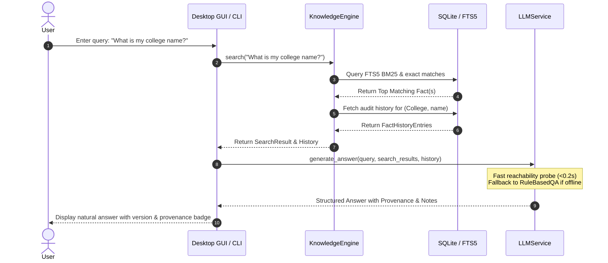
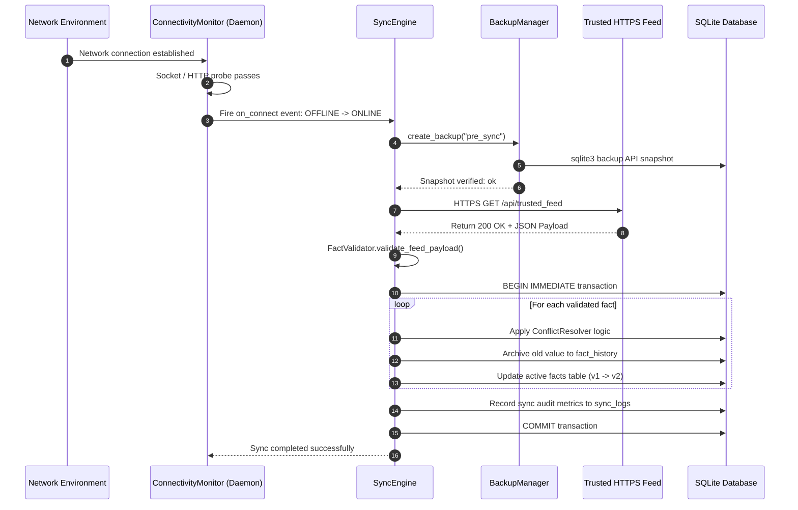
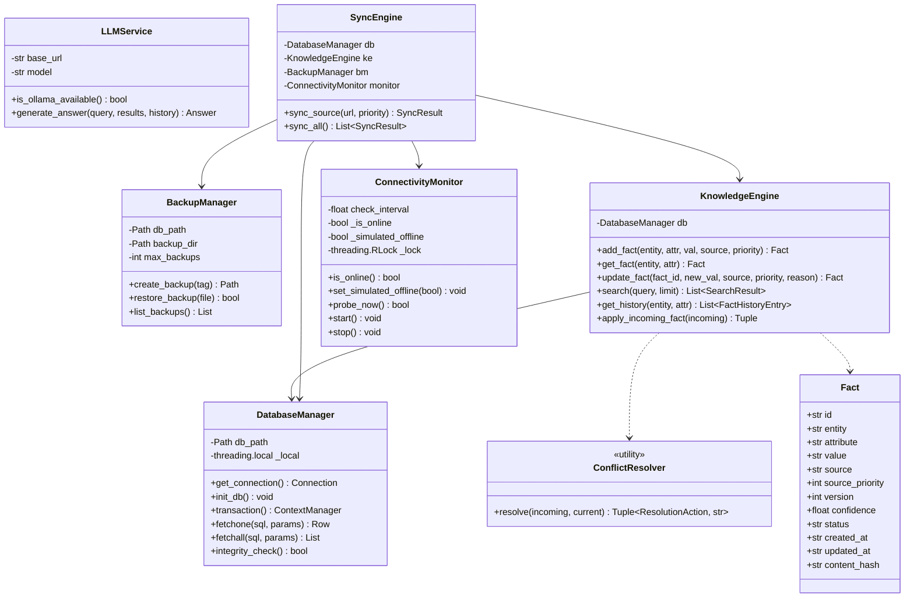

# OfflineMind: System Design & Architecture Specification

**Document ID**: SDD-OM-2026-V1  
**Project**: OfflineMind  
**Author**: Lead Software Architect  
**Version**: 1.0.0  

---

## 1. Architectural Overview

OfflineMind is structured around an **offline-first layered modular architecture** designed for high reliability, zero latency on local reads, and crash-resilient asynchronous updates.

```mermaid
graph TD
    subgraph UI_Layer [User Interface Layer]
        GUI[Tkinter Desktop GUI<br/>(gui_app.py)]
        CLI[Terminal CLI & Shell<br/>(cli.py)]
    end

    subgraph Service_Layer [Application Services]
        LLM[LLM Service & Extractive Fallback<br/>(llm_client.py)]
        SYNC[Sync Engine & Validator<br/>(sync_engine.py)]
        MONITOR[Connectivity Monitor<br/>(connectivity.py)]
    end

    subgraph Core_Layer [Core Business Domain]
        KE[Knowledge Engine<br/>(knowledge_engine.py)]
        CR[Conflict Resolver<br/>(conflict_resolver.py)]
    end

    subgraph Storage_Layer [Storage & Persistence]
        DB[(SQLite3 + WAL Mode<br/>offlinemind.db)]
        FTS[FTS5 Virtual Index<br/>(facts_fts)]
        BM[Backup Manager<br/>(backup.py)]
    end

    subgraph External [External Environment]
        OLLAMA((Local Ollama Daemon<br/>port 11434))
        TRUSTED((Trusted Sources<br/>HTTPS Feeds))
    end

    GUI --> LLM
    GUI --> SYNC
    GUI --> MONITOR
    CLI --> LLM
    CLI --> SYNC

    LLM --> KE
    LLM -.->|Optional Probe| OLLAMA
    SYNC --> KE
    SYNC --> BM
    SYNC --> MONITOR
    SYNC -.->|HTTPS / Local Mock| TRUSTED

    MONITOR -.->|Socket / DNS Probe| External

    KE --> CR
    KE --> DB
    KE --> FTS
    BM --> DB
```

---

## 2. Component Descriptions

### 2.1 Storage & Persistence Layer (`offlinemind.db`)
- **`DatabaseManager`**: Provides thread-local connection management, configures SQLite with `PRAGMA journal_mode = WAL`, `synchronous = NORMAL`, and `busy_timeout = 10000`. Employs re-entrant atomic transactions using SQLite savepoints (`SAVEPOINT sp_X`).
- **`BackupManager`**: Leverages SQLite's Online Backup API (`sqlite3.Connection.backup`) to capture verified, non-blocking point-in-time snapshots before any network write operations. Manages automated snapshot rotation with retention capping.

### 2.2 Core Business Domain Layer
- **`KnowledgeEngine`**: Manages the lifecycle of discrete knowledge facts `(entity, attribute, value)`. Implements multi-stage search (Exact Entity/Attribute match -> FTS5 BM25 ranked match -> Jaccard token overlap). Archives prior fact versions immutably into `fact_history`.
- **`ConflictResolver`**: Deterministic resolution engine evaluating incoming facts against active local facts via a priority matrix, timestamp ordering, and confidence score delta thresholds.

### 2.3 Service & Sync Layer
- **`LLMService`**: Detects local Ollama instance reachability via low-overhead socket probing. If Ollama is present, generates context-grounded responses. If absent, executes deterministic `RuleBasedRetrievalQA` with provenance formatting.
- **`ConnectivityMonitor`**: Background daemon executing debounced socket and HTTP reachability checks without blocking the main event loop. Exposes simulated offline mode and transition callbacks.
- **`SyncEngine` & `FactValidator`**: Enforces HTTPS URL policies, validates payloads against strict type and length schemas, cleanses control characters, creates safety snapshots, and executes atomic transaction commits.

---

## 3. Sequence & Data-Flow Diagrams

### 3.1 Offline Query Flow


### 3.2 Connectivity Detection & Auto-Sync Flow


---

## 4. Class Diagram



---

## 5. Technology Justification

| Technology | Selection Rationale | Alternatives Considered | Tradeoff Justification |
|---|---|---|---|
| **SQLite 3 + FTS5** | Zero external server dependency, embedded ACID transactions, built-in BM25 full-text indexing, < 5 MB footprint. | PostgreSQL, MongoDB | Standalone database servers violate the offline single-user constraint and consume excessive RAM. |
| **Python Standard Library (Tkinter)** | Native on Windows/macOS/Linux, starts in < 100ms, zero port conflicts, consumes < 30 MB RAM. | Electron, Streamlit | Streamlit requires a persistent local web server, opening local ports and adding 150+ MB memory overhead. |
| **Ollama Local REST** | Standardized local LLM API with quantized GGUF models running fully offline on local CPU/GPU. | Hugging Face Transformers in-process | Loading PyTorch/Transformers directly into Python process consumes 2+ GB RAM, risking out-of-memory errors on 8 GB systems. |
| **Requests + Threading** | Robust HTTP connection pooling, standard timeout semantics, low CPU overhead. | Asyncio / aiohttp | Synchronous threaded execution integrates cleanly with Tkinter and SQLite without complex event loop bridging. |

---

## 6. Error Handling & Resilience Architecture

1. **Transaction Isolation & Rollback**:
   Every database mutation executes inside `with db.transaction():`. SQLite savepoints guarantee that nested transactions either commit in full or roll back completely without partial state contamination.
2. **Point-in-Time Backup**:
   The `BackupManager` executes an SQLite online backup before establishing any remote network connection. If hardware fails or memory corruption occurs during sync, the database can be restored with 100% fidelity.
3. **Graceful Inference Degradation**:
   The `LLMService` utilizes a sub-200ms socket probe to test Ollama reachability. If Ollama is offline or uninstalled, inference silently shifts to the deterministic `RuleBasedRetrievalQA` engine without displaying error popups to the user.
4. **Re-entrant Thread Locking**:
   The `ConnectivityMonitor` uses `threading.RLock` to eliminate recursive deadlock between UI status refresh pollers and background sync triggers.

---

## 7. Security Architecture

1. **Zero Data Leakage**: OfflineMind contains zero telemetry SDKs, external reporting hooks, or cloud dependencies. All user queries stay on the local machine.
2. **Transport Security (HTTPS Enforcement)**: External sync URLs must use HTTPS. Insecure HTTP is permitted only for loopback addresses (`127.0.0.1`, `localhost`) to accommodate local test servers.
3. **Payload Sanitization**: Incoming feeds are filtered through regex sanitizers to strip null bytes (`\x00`), non-printable ASCII control characters, and abnormal length buffers.
4. **Parameter Binding**: 100% of SQLite database queries use parameterized placeholders (`?`), preventing SQL injection attacks.
