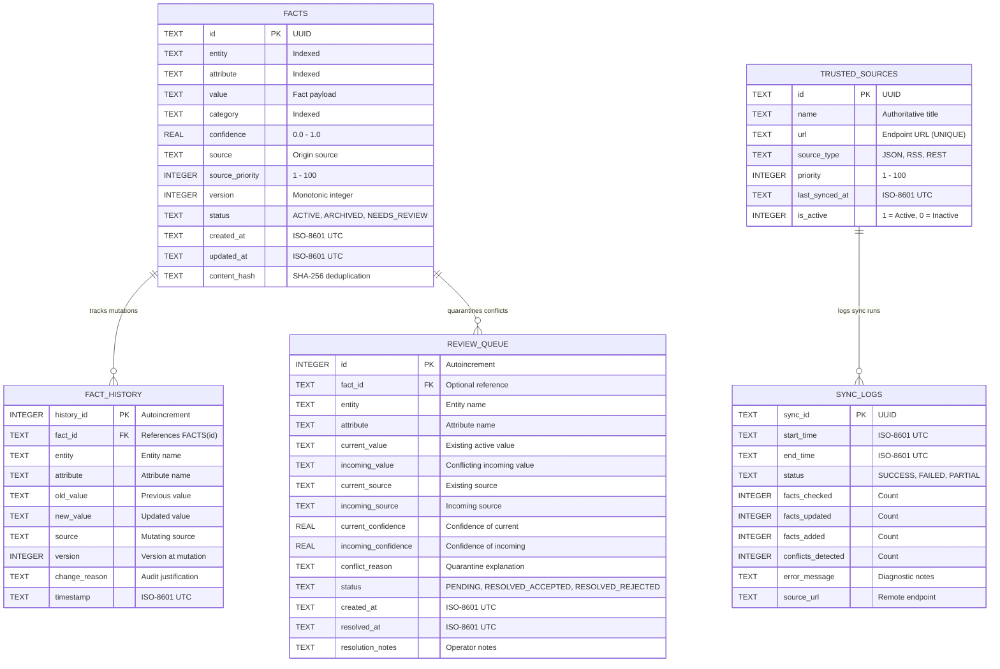

# OfflineMind: Database Architecture & Data Dictionary

**Document ID**: DBD-OM-2026-V1  
**Database Engine**: SQLite 3 (Version 3.45+) with WAL Mode & FTS5  
**Schema Version**: 1.0.0  

---

## 1. Entity-Relationship (ER) Diagram



---

## 2. Table Definitions & Constraints

### 2.1 Table: `facts` (Core Knowledge Units)
Stores active verified knowledge triples with metadata.

| Column | Data Type | Constraints | Description |
|---|---|---|---|
| `id` | TEXT | PRIMARY KEY | Unique UUID identifier for the fact. |
| `entity` | TEXT | NOT NULL | Subject or entity (e.g. `College`, `User`, `Course`). |
| `attribute` | TEXT | NOT NULL | Property or predicate (e.g. `name`, `major`, `dean`). |
| `value` | TEXT | NOT NULL | Stored factual value or text statement. |
| `category` | TEXT | DEFAULT 'general' | Domain classification (`education`, `personal`, `facilities`). |
| `confidence` | REAL | DEFAULT 1.0, CHECK (confidence >= 0.0 AND confidence <= 1.0) | Degree of factual certainty [0.0 to 1.0]. |
| `source` | TEXT | NOT NULL | Name or identifier of origin publication. |
| `source_priority` | INTEGER | DEFAULT 50 | Relative authority score [1 to 100]. |
| `version` | INTEGER | DEFAULT 1 | Monotonically increasing version counter. |
| `status` | TEXT | DEFAULT 'ACTIVE', CHECK (status IN ('ACTIVE', 'ARCHIVED', 'NEEDS_REVIEW')) | Lifecycle state. |
| `created_at` | TEXT | NOT NULL | ISO-8601 UTC creation timestamp. |
| `updated_at` | TEXT | NOT NULL | ISO-8601 UTC last modification timestamp. |
| `content_hash` | TEXT | | SHA-256 hash of `entity:attribute:value` for deduplication. |

**Indexes**:
- `idx_facts_entity_attr` ON `facts(entity, attribute)`
- `idx_facts_status` ON `facts(status)`
- `idx_facts_category` ON `facts(category)`

---

### 2.2 Table: `fact_history` (Immutable Audit Trail)
Preserves historical states of mutated facts. Entries are append-only.

| Column | Data Type | Constraints | Description |
|---|---|---|---|
| `history_id` | INTEGER | PRIMARY KEY AUTOINCREMENT | Unique sequence identifier. |
| `fact_id` | TEXT | NOT NULL, REFERENCES `facts(id)` ON DELETE CASCADE | Foreign key to root fact. |
| `entity` | TEXT | NOT NULL | Subject entity. |
| `attribute` | TEXT | NOT NULL | Subject attribute. |
| `old_value` | TEXT | | Value prior to mutation (`NULL` on initial creation). |
| `new_value` | TEXT | NOT NULL | Value after mutation. |
| `source` | TEXT | NOT NULL | Source advocating the change. |
| `version` | INTEGER | NOT NULL | Version number prior to or at mutation. |
| `change_reason` | TEXT | | Justification or rule triggering the change. |
| `timestamp` | TEXT | NOT NULL | ISO-8601 UTC mutation timestamp. |

**Indexes**:
- `idx_history_fact_id` ON `fact_history(fact_id)`
- `idx_history_entity_attr` ON `fact_history(entity, attribute)`
- `idx_history_timestamp` ON `fact_history(timestamp)`

---

### 2.3 Table: `review_queue` (Conflict Quarantine)
Holds ambiguous or low-confidence updates for administrative review.

| Column | Data Type | Constraints | Description |
|---|---|---|---|
| `id` | INTEGER | PRIMARY KEY AUTOINCREMENT | Unique conflict ticket identifier. |
| `fact_id` | TEXT | | Optional reference to existing fact. |
| `entity` | TEXT | NOT NULL | Subject entity. |
| `attribute` | TEXT | NOT NULL | Subject attribute. |
| `current_value` | TEXT | | Current active value stored. |
| `incoming_value` | TEXT | NOT NULL | Contradicting incoming value. |
| `current_source` | TEXT | | Source of active fact. |
| `incoming_source` | TEXT | NOT NULL | Source of incoming fact. |
| `current_confidence` | REAL | | Active confidence level. |
| `incoming_confidence` | REAL | | Incoming confidence level. |
| `conflict_reason` | TEXT | NOT NULL | Detailed diagnostic explanation of conflict. |
| `status` | TEXT | DEFAULT 'PENDING', CHECK (status IN ('PENDING', 'RESOLVED_ACCEPTED', 'RESOLVED_REJECTED')) | Ticket review status. |
| `created_at` | TEXT | NOT NULL | ISO-8601 UTC quarantine timestamp. |
| `resolved_at` | TEXT | | ISO-8601 UTC resolution timestamp. |
| `resolution_notes` | TEXT | | Operator comments on resolution. |

---

### 2.4 Table: `sync_logs` (Synchronization Audit Log)
Records metrics, duration, and outcomes of synchronization events.

| Column | Data Type | Constraints | Description |
|---|---|---|---|
| `sync_id` | TEXT | PRIMARY KEY | Unique UUID for the sync run. |
| `start_time` | TEXT | NOT NULL | ISO-8601 UTC execution start. |
| `end_time` | TEXT | | ISO-8601 UTC execution completion. |
| `status` | TEXT | NOT NULL, CHECK (status IN ('IN_PROGRESS', 'SUCCESS', 'FAILED', 'PARTIAL')) | Outcome code. |
| `facts_checked` | INTEGER | DEFAULT 0 | Count of feed items parsed. |
| `facts_updated` | INTEGER | DEFAULT 0 | Count of active facts modified. |
| `facts_added` | INTEGER | DEFAULT 0 | Count of novel facts inserted. |
| `conflicts_detected` | INTEGER | DEFAULT 0 | Count of items quarantined to review queue. |
| `error_message` | TEXT | | Diagnostics on failure or partial validation. |
| `source_url` | TEXT | | Remote endpoint URL. |

---

### 2.5 Table: `trusted_sources` (Source Configuration)
Manages authorized external endpoints and their authority rankings.

| Column | Data Type | Constraints | Description |
|---|---|---|---|
| `id` | TEXT | PRIMARY KEY | UUID identifier. |
| `name` | TEXT | NOT NULL | Human-readable source title. |
| `url` | TEXT | NOT NULL UNIQUE | HTTPS endpoint URL. |
| `source_type` | TEXT | DEFAULT 'JSON' | Feed format (`JSON`, `RSS`, `REST`). |
| `priority` | INTEGER | DEFAULT 50, CHECK (priority >= 1 AND priority <= 100) | Authority weight. |
| `last_synced_at` | TEXT | | Timestamp of last successful sync. |
| `is_active` | INTEGER | DEFAULT 1 | 1 for active, 0 for disabled. |

---

### 2.6 Virtual Table: `facts_fts` (FTS5 Full-Text Index)
SQLite FTS5 virtual table indexing `entity`, `attribute`, `value`, and `category` using the Porter tokenizer and external content synchronization via triggers (`facts_ai`, `facts_ad`, `facts_au`).

---

## 3. Sample SQL Walkthrough: The College Rename Lifecycle

Below is the exact SQL transaction sequence executed during the 4-step college rename demonstration:

### Step 1: Initial State (Offline Baseline)
```sql
-- Insert initial college name fact
INSERT INTO facts (
    id, entity, attribute, value, category, confidence,
    source, source_priority, version, status, created_at, updated_at, content_hash
) VALUES (
    'f101-uuid', 'College', 'name', 'Springfield Technical College', 'education', 1.0,
    'Student Handbook 2024', 50, 1, 'ACTIVE',
    '2026-01-15T09:00:00Z', '2026-01-15T09:00:00Z',
    '15bf1931b10fd4ea4937203aaa8a60f816e4e45c1e9ab07907829c867e5d9a17'
);

-- Record baseline in history
INSERT INTO fact_history (
    fact_id, entity, attribute, old_value, new_value, source, version, change_reason, timestamp
) VALUES (
    'f101-uuid', 'College', 'name', NULL, 'Springfield Technical College',
    'Student Handbook 2024', 1, 'Initial creation', '2026-01-15T09:00:00Z'
);
```

### Step 2: Querying During Offline Mode
```sql
-- Retrieve fact via exact attribute search
SELECT * FROM facts 
WHERE LOWER(entity) = 'college' AND LOWER(attribute) = 'name' AND status = 'ACTIVE';

-- Local BM25 Full-Text Retrieval via FTS5
SELECT f.*, rank 
FROM facts_fts 
JOIN facts f ON f.rowid = facts_fts.rowid
WHERE facts_fts MATCH 'College OR name'
ORDER BY rank;
```

### Step 3: Atomic Sync & Mutation on Connectivity Restoration
```sql
-- Transaction begins
BEGIN IMMEDIATE;

-- 1. Archive previous state into immutable history
INSERT INTO fact_history (
    fact_id, entity, attribute, old_value, new_value, source, version, change_reason, timestamp
) VALUES (
    'f101-uuid', 'College', 'name', 'Springfield Technical College',
    'Springfield University of Technology & AI', 'Official University Registrar',
    1, 'Source priority (85 for Official University Registrar) exceeds current (50).',
    '2026-10-03T08:06:40Z'
);

-- 2. Update active fact (version increments from 1 to 2)
UPDATE facts SET
    value = 'Springfield University of Technology & AI',
    source = 'Official University Registrar',
    source_priority = 85,
    version = version + 1,
    updated_at = '2026-10-03T08:06:40Z',
    content_hash = '97ffbc7d1659cde60aa4fcfa506e5fdb74e767de9c1870160df85232efed6156'
WHERE id = 'f101-uuid';

-- 3. Record sync log
INSERT INTO sync_logs (
    sync_id, start_time, end_time, status,
    facts_checked, facts_updated, facts_added, conflicts_detected, source_url
) VALUES (
    'sync-uuid-889', '2026-10-03T08:06:39Z', '2026-10-03T08:06:40Z', 'SUCCESS',
    3, 1, 2, 0, 'https://registrar.university.edu/api/trusted_feed'
);

-- Commit transaction atomically
COMMIT;
```

### Step 4: Querying History and Answering After Update
```sql
-- Fetch complete mutation audit trail
SELECT version, old_value, new_value, source, change_reason, timestamp
FROM fact_history
WHERE LOWER(entity) = 'college' AND LOWER(attribute) = 'name'
ORDER BY timestamp DESC;
```

---

## 4. Backup & Disaster Recovery Architecture

1. **Pre-Sync Snapshotting**: Prior to remote sync, OfflineMind calls SQLite's Online Backup API:
   `sqlite3.Connection.backup(dst, pages=100)`.
2. **Snapshot Verification**: The generated snapshot file is immediately verified using:
   `PRAGMA integrity_check;`. If the check fails, the snapshot is deleted and the sync is aborted.
3. **Backup Pruning**: Snapshots are rotated automatically, retaining the 10 most recent verified copies in `data/backups/`.
4. **Point-in-Time Restore**: If active database corruption is detected, `BackupManager.restore_backup()` verifies and restores the latest snapshot in under 50 milliseconds.

---

## 5. Normalization Analysis

- **Core Tables**: Normalized to **Third Normal Form (3NF)**. Facts represent atomic triples. Attribute names and entity names are decoupled from values.
- **Fact History Table**: Intentionally denormalizes `entity` and `attribute` to preserve immutable historical snapshots even if parent fact references change.
- **FTS5 Table**: Uses a virtual shadow table structure that avoids content duplication via SQLite's `content='facts'` architecture.
